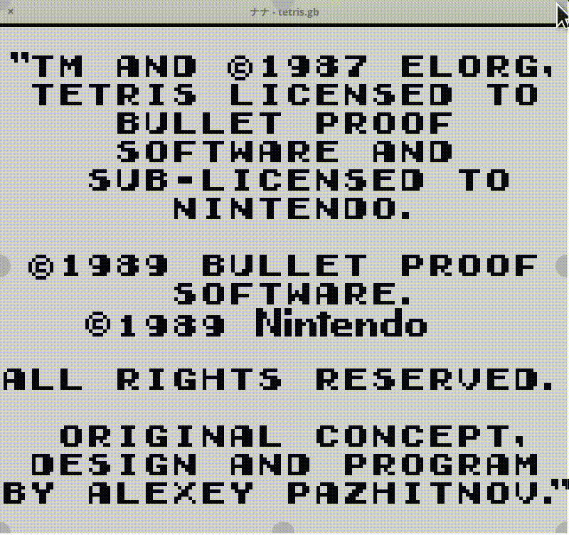

# Nana (ナナ) [](https://circleci.com/gh/Ruenzuo/nana/tree/master) [](https://codecov.io/gh/Ruenzuo/nana)

> “The more my dreams are fulfilled, the quicklier they become realities losing their shine.”
>
> [Nana (manga), by Ai Yazawa](https://en.wikipedia.org/wiki/Nana_(manga))

Nana (ナナ) is a [Game Boy](https://en.wikipedia.org/wiki/Game_Boy) emulator written in Go. It's far from feature complete and there are still bugs in what it's implemented but what I got here helped me a lot to understand how computers work at one of their lowest levels, I hope this too helps someone else.



### ROM Compatibility list

- [x] Tetris
- [x] The Legend of Zelda: Link's Awakening

### Dependencies

Linux dependencies are listed [here](./Dockerfile).

### Installation

```
$ go get github.com/Ruenzuo/nana
```

### Usage

```
$ nana path/to/rom.gb
```

### Environment variables

* `DEBUG`: enables buffered debug output to nana.log
* `ENABLE_LCD_STATE_DEBUG`: includes the LCD state in debug output
* `MAX_CYCLES`: enables automatic shut down to specific cycle threshold

### Building your own emulator

* Start with 8-bit system
* Performance matters, profile constantly against other emulators to check how you're doing so far. You can get some inspiration from [hachiko](https://github.com/Ruenzuo/hachiko)
* Implement the [full instruction set](./emulator/instruction_set.go) + [jump table](./emulator/jump_table.go) **first**. Then try your work against an [emulation test collection](https://github.com/retrio/gb-test-roms), these are excelent to catch edge cases and implement the bugs the original systems had
* [Game Boy CPU Manual](http://www.codeslinger.co.uk/pages/projects/gameboy/files/GB.pdf)
* [Game Boy Programming Manual](https://archive.org/download/GameBoyProgManVer1.1/GameBoyProgManVer1.1.pdf)
